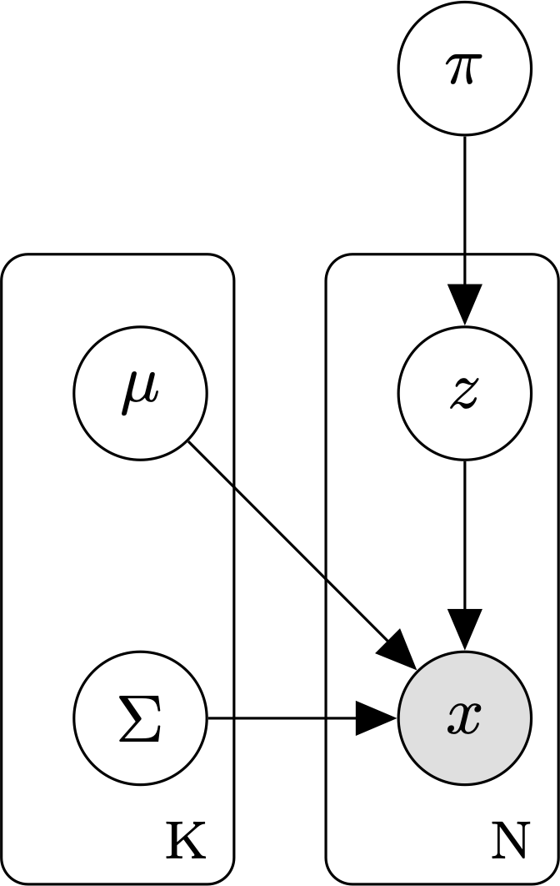

#######################
Gaussian mixture models
#######################

A `Gaussian mixture model`_ (GMM) is a latent variable model commonly used for
unsupervised clustering.

    Graphical model for a GMM with `K` mixture components and `N` data points.

.. _`Gaussian mixture model` : https://en.wikipedia.org/wiki/Mixture_model#Gaussian_mixture_model

A GMM assumes that:

    1. The observed data are generated from a `mixture distribution`_, `P`,
       made up of `K` mixture components.

    2. Each mixture component is a multivariate Gaussian with its own mean
       :math:`\mu`, covariance matrix, :math:`\Sigma`, and mixture weight,
       :math:`\pi`.

    .. 3. To generate a new data point, we sample a mixture component in
    .. proportion to its prior probability, then draw a sample from the
    .. distribution parameterized by that component's mean and covariance.

.. _mixture distribution: https://en.wikipedia.org/wiki/Mixture_distribution

The parameters of a GMM model are:

    - :math:`\theta`, the set of parameters for each of the `K` mixture
      components. :math:`\theta = \{ \mu_1, \Sigma_1, \pi_i, \ldots, \mu_k,
      \Sigma_k, \pi_k \}`.

Under a GMM, the joint probability of a sequence of cluster assignments `Z` and an observed
dataset :math:`X = \{x_1, \ldots, x_N \}`, is:

.. math::
    p(Z, X \mid \theta) =
        \prod_{i=1}^N p(z_i, x_i \mid \theta) =
            \prod_{i=1}^N \prod_{k=1}^K
                [\mathcal{N}(x_i \mid \mu_k, \Sigma_k) \pi_k ]^{\mathbb{1}_{[z_{i} = k]}}

where

    - :math:`\theta` is the set of GMM parameters: :math:`\theta = \{ \mu_1,
      \Sigma_1, \pi_i, \ldots, \mu_k, \Sigma_k, \pi_k \}`.

    - :math:`Z_i \in \{ 1, \ldots, k \}` is a latent variable reflecting the ID
      of the mixture component that generated data point `i`.

    - :math:`\mathbb{1}_{[z_i = k]}` is a binary indicator function returning
      1 if data point :math:`x_i` was sampled from mixture component :math:`k`
      and 0 otherwise.

As with other latent-variable models, we use the `expectation-maximization (EM)
algorithm`_ to learn the GMM parameters.

.. _expectation-maximization (EM) algorithm : https://en.wikipedia.org/wiki/Expectation%E2%80%93maximization_algorithm

**Models**

- :class:`~numpy_ml.gmm.GMM`

**References**

.. [1] Bilmes, J. A. (1998). "A gentle tutorial of the EM algorithm and its
   application to parameter estimation for Gaussian mixture and hidden
   Markov models" *International Computer Science Institute, 4(510)*
   https://www.inf.ed.ac.uk/teaching/courses/pmr/docs/EM.pdf

.. toctree::
   :maxdepth: 2
   :hidden:

   numpy_ml.gmm.gmm
