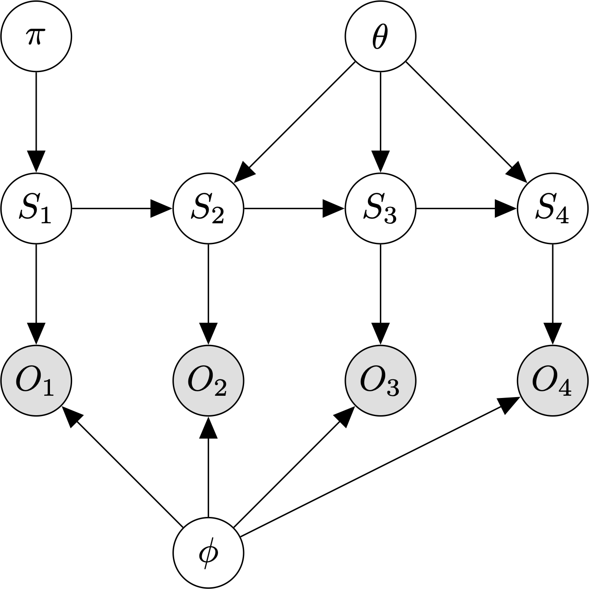

####################
Hidden Markov models
####################

A `hidden Markov model`_ (HMM) is a generative model for sequences of observations.

.. _`hidden Markov model` : https://en.wikipedia.org/wiki/Hidden_Markov_model

    Graphical model for an HMM with :math:`T=4` timesteps.

An HMM assumes:

    1. The observations, `O`, are generated by a process whose states,
       :math:`S`, are *hidden* from the observer.

    2. Each hidden state is a discrete random variable.

    3. The hidden state at time `t` is independent of all hidden states before
       time :math:`t - 1`.

    4. The observation :math:`O_t` is independent of all previous states and
       observations given the current hidden state, :math:`S_t`.

The parameters of an HMM model are:

    - :math:`\pi`, the prior specifying :math:`P(S_1)`.

    - :math:`\theta`, the :math:`K \times K` transition matrix specifying
      :math:`P(S_t \mid S_{t-1})`.

    - :math:`\phi`, the output model defining :math:`P(Y_t \mid S_t)`. If the
      observations are discrete, this is a :math:`K \times L` emission matrix,
      where `L` is the number of unique observation symbols.

The HMM joint distribution of a sequence of states and observations is:

.. math::

    P(S_{1:T}, O_{1:T}) = P(S_1) P(O_1 \mid S_1) \prod_{t=2}^T P(S_t \mid S_{t-1})P(O_t \mid S_t)

where :math:`X_{1:T}` is shorthand for :math:`X_1, \ldots, X_T`.

As with other latent-variable models, we use the `expectation-maximization
(EM) algorithm`_ to learn the model parameters.  The HMM-optimized version of
the EM algorithm is known as the `forward-backward`_ / `Baum-Welch algorithm`_.

.. _expectation-maximization (EM) algorithm : https://en.wikipedia.org/wiki/Expectation%E2%80%93maximization_algorithm
.. _forward-backward: https://en.wikipedia.org/wiki/Forward%E2%80%93backward_algorithm
.. _Baum-Welch algorithm: https://en.wikipedia.org/wiki/Baum%E2%80%93Welch_algorithm

**Models**

- :class:`~numpy_ml.hmm.MultinomialHMM`

**References**

.. [1] Ghahramani, Z. (2001). "An Intro to HMMs and Bayesian networks".
       *International Journal of Pattern Recognition and AI, 15(1)*: 9-42.

.. toctree::
   :maxdepth: 2
   :hidden:

   numpy_ml.hmm.MultinomialHMM
