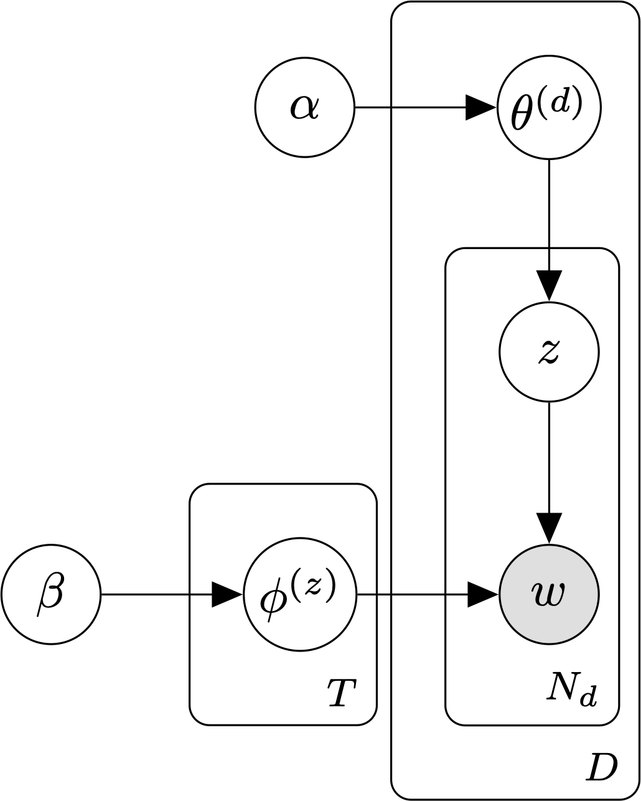

###########################
Latent Dirichlet allocation 
###########################

Latent Dirichlet allocation (LDA, commonly known as a "topic model") is a
generative model for `bags of words`_.  

.. _bags of words : https://en.wikipedia.org/wiki/Bag-of-words_model

    The smoothed LDA model with `T` topics, `D` documents, and :math:`N_d` words per document.

In LDA, each word in a piece of text is associated with one of `T` latent
"topics." A "document" is an unordered collection ("bag") of words, and as a
result constitutes a particular mixture of these `T` latent topics. During
inference, the goal is to estimate probability of each word token under each
topic, along with the per-document topic mixture weights, using only the
observed text.

Specifically, the parameters of the LDA model are:

    - :math:`\theta`, the document-topic distribution. We use :math:`\theta^{(i)}` to denote the parameters of the `categorical`_ distribution over topics associated with document :math:`i`.

    - :math:`\phi`, the topic-word distribution. We use :math:`\phi^{(j)}` to denote the parameters of the `categorical`_ distribution over words associated with topic :math:`j`.

.. _categorical : https://en.wikipedia.org/wiki/Categorical_distribution

The standard LDA model places a Dirichlet prior on :math:`\theta`:

.. math::
    \theta^{(d)}  \sim  \text{Dir}(\alpha)

The smoothed/fully-Bayesian LDA model adds an additional Dirichlet prior on :math:`\phi`:

.. math::
    \phi^{(j)}  \sim  \text{Dir}(\beta)

To generate a document with the smoothed LDA model, we:

    1. Sample the parameters for the distribution over topics, :math:`\theta \sim \text{Dir}(\alpha)`.

    2. Sample a topic, :math:`z \sim \text{Cat}(\theta)`.

    3. If we haven't already, sample the parameters for topic `z`'s categorical distribution over words, :math:`\phi^{(z)} \sim \text{Dir}(\beta)`.

    4. Sample a word, :math:`w \sim \text{Cat}(\phi^{(z)})`.

    5. Repeat steps 2 through 4 until we have a bag of `N` words.

The joint distribution over words, topics, :math:`\theta`, and :math:`\phi`
under the smoothed LDA model is:

.. math::
    
    P(w, z, \phi, \theta \mid \alpha, \beta) = \left( \prod_{t=1}^T \text{Dir}(\phi^{(t)}; \beta) \right) \prod_{d=1}^D \text{Dir}(\theta^{(d)}; \alpha) \prod_{n=1}^{N_d} P(z_n \mid \theta^{(d)}) P(w_n \mid \phi^{(z_n)}) 

.. topic:: References

    .. [1]  Blei, Ng, & Jordan (2003). "Latent Dirichlet allocation". *Journal of
       Machine Learning Research*, *3*, 993–1022.
    .. [2]  Griffiths & Steyvers (2004). "Finding scientific topics". *PNAS*,
       *101(1)*, 5228-5235.

.. toctree::
   :maxdepth: 3

   numpy_ml.lda.lda
   numpy_ml.lda.smoothed_lda
