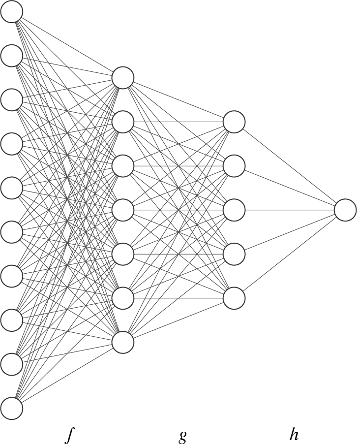

Neural networks
###############
The neural network module includes common building blocks for implementing
modern `deep learning`_ models.

.. _`deep learning`: https://en.wikipedia.org/wiki/Deep_learning

.. raw:: html

   <h2>Layers</h2>

Most modern neural networks can be represented as a `composition`_ of
many small, parametric functions. The functions in this composition are
commonly referred to as the "layers" of the network. As an example, the
multilayer perceptron (MLP) below computes the function :math:`(f
\circ g \circ h)` where, `f`, `g`, and `h` are the individual network layers.

    A multilayer perceptron with three layers labeled `f`, `g`, and `h`.

Many neural network layers are parametric: they express different
transformations depending on the setting of their weights (coefficients),
biases (intercepts), and/or other tunable values. These parameters are adjusted
during training to improve the performance of the network on a particular
metric.

The :doc:`numpy_ml.neural_nets.layers` module contains a number of common
transformations that can be composed to create larger networks.

.. _`composition`: https://en.wikipedia.org/wiki/Function_composition

**Layers**

+-----------------------------------------------------+-------------------------------------------------------------+---------------------------------------------------------+
| - :class:`~numpy_ml.neural_nets.layers.Add`         | - :class:`~numpy_ml.neural_nets.layers.Deconv2D`            | - :class:`~numpy_ml.neural_nets.layers.LSTM`            |
+-----------------------------------------------------+-------------------------------------------------------------+---------------------------------------------------------+
| - :class:`~numpy_ml.neural_nets.layers.BatchNorm1D` | - :class:`~numpy_ml.neural_nets.layers.DotProductAttention` | - :class:`~numpy_ml.neural_nets.layers.LSTMCell`        |
+-----------------------------------------------------+-------------------------------------------------------------+---------------------------------------------------------+
| - :class:`~numpy_ml.neural_nets.layers.BatchNorm2D` | - :class:`~numpy_ml.neural_nets.layers.Embedding`           | - :class:`~numpy_ml.neural_nets.layers.LayerNorm1D`     |
+-----------------------------------------------------+-------------------------------------------------------------+---------------------------------------------------------+
| - :class:`~numpy_ml.neural_nets.layers.Conv1D`      | - :class:`~numpy_ml.neural_nets.layers.Flatten`             | - :class:`~numpy_ml.neural_nets.layers.LayerNorm2D`     |
+-----------------------------------------------------+-------------------------------------------------------------+---------------------------------------------------------+
| - :class:`~numpy_ml.neural_nets.layers.Conv2D`      | - :class:`~numpy_ml.neural_nets.layers.FullyConnected`      | - :class:`~numpy_ml.neural_nets.layers.Multiply`        |
+-----------------------------------------------------+-------------------------------------------------------------+---------------------------------------------------------+
| - :class:`~numpy_ml.neural_nets.layers.Pool2D`      | - :class:`~numpy_ml.neural_nets.layers.RNN`                 | - :class:`~numpy_ml.neural_nets.layers.RNNCell`         |
+-----------------------------------------------------+-------------------------------------------------------------+---------------------------------------------------------+
| - :class:`~numpy_ml.neural_nets.layers.RBM`         | - :class:`~numpy_ml.neural_nets.layers.Softmax`             | - :class:`~numpy_ml.neural_nets.layers.SparseEvolution` |
+-----------------------------------------------------+-------------------------------------------------------------+---------------------------------------------------------+

.. raw:: html

   <h2>Activations</h2>

Each unit in a neural network sums its input and passes it through an
`activation function`_ before sending it on to its outgoing weights. Activation
functions in most modern networks are real-valued, non-linear functions that
are computationally inexpensive to compute and easily differentiable.

The :doc:`Activations <numpy_ml.neural_nets.activations>` module contains a
number of common activation functions.

.. _`activation function`: https://en.wikipedia.org/wiki/Activation_function

**Activations**

+----------------------------------------------------------+--------------------------------------------------------+-------------------------------------------------------+
| - :class:`~numpy_ml.neural_nets.activations.Affine`      | - :class:`~numpy_ml.neural_nets.activations.Identity`  | - :class:`~numpy_ml.neural_nets.activations.Sigmoid`  |
|----------------------------------------------------------|--------------------------------------------------------|-------------------------------------------------------|
| - :class:`~numpy_ml.neural_nets.activations.ELU`         | - :class:`~numpy_ml.neural_nets.activations.LeakyReLU` | - :class:`~numpy_ml.neural_nets.activations.SoftPlus` |
| - :class:`~numpy_ml.neural_nets.activations.Exponential` | - :class:`~numpy_ml.neural_nets.activations.ReLU`      | - :class:`~numpy_ml.neural_nets.activations.Tanh`     |
| - :class:`~numpy_ml.neural_nets.activations.HardSigmoid` | - :class:`~numpy_ml.neural_nets.activations.SELU`      |                                                       |
+----------------------------------------------------------+--------------------------------------------------------+-------------------------------------------------------+

.. raw:: html

   <h2>Losses</h2>

Training a neural network involves searching for layer parameters that optimize
the network's performance on a given task. `Loss functions`_ are the
quantitative metric we use to measure how well the network is performing. Loss
functions are typically scalar-valued functions of a network's output on some
training data.

The :doc:`Losses <numpy_ml.neural_nets.losses>` module contains loss functions
for a number of common tasks.

.. _`Loss functions`: https://en.wikipedia.org/wiki/Loss_function

**Losses**

+------------------------------------------------------+-------------------------------------------------+-----------------------------------------------------+
| - :class:`~numpy_ml.neural_nets.losses.CrossEntropy` | - :class:`~numpy_ml.neural_nets.losses.NCELoss` | - :class:`~numpy_ml.neural_nets.losses.WGAN_GPLoss` |
|------------------------------------------------------|-------------------------------------------------|-----------------------------------------------------|
| - :class:`~numpy_ml.neural_nets.losses.SquaredError` | - :class:`~numpy_ml.neural_nets.losses.VAELoss` |                                                     |
+------------------------------------------------------+-------------------------------------------------+-----------------------------------------------------+

.. raw:: html

   <h2>Optimizers</h2>

The :doc:`Optimizers <numpy_ml.neural_nets.optimizers>` module contains several
popular gradient-based strategies for adjusting the parameters of a neural
network to optimize a loss function. The proper choice of optimization strategy
can help reduce training time / speed up convergence, though see [1]_ for a
discussion on the generalization performance of the solutions identified via
different strategies.

.. [1] Wilson, A. C., Roelofs, R., Stern, M., Srebro, M., & Recht, B. (2017)
   "The marginal value of adaptive gradient methods in machine learning",
   *Proceedings of the 31st Conference on Neural Information Processing
   Systems*. https://arxiv.org/pdf/1705.08292.pdf

**Optimizers**

+-------------------------------------------------+-----------------------------------------------------+--------------------------------------------------+-----------------------------------------------------+
| - :class:`~numpy_ml.neural_nets.optimizers.SGD` | - :class:`~numpy_ml.neural_nets.optimizers.AdaGrad` | - :class:`~numpy_ml.neural_nets.optimizers.Adam` | - :class:`~numpy_ml.neural_nets.optimizers.RMSProp` |
+-------------------------------------------------+-----------------------------------------------------+--------------------------------------------------+-----------------------------------------------------+

.. raw:: html

   <h2>Learning Rate Schedulers</h2>

It is common to reduce an optimizer's learning rate(s) over the course of
training in order to eke out additional performance improvements. The
:doc:`Schedulers <numpy_ml.neural_nets.schedulers>` module contains several
strategies for automatically adjusting the learning rate as a function of the
number of elapsed training steps.

**Schedulers**

+---------------------------------------------------------------+------------------------------------------------------------------+-----------------------------------------------------------+
| - :class:`~numpy_ml.neural_nets.schedulers.ConstantScheduler` | - :class:`~numpy_ml.neural_nets.schedulers.ExponentialScheduler` | - :class:`~numpy_ml.neural_nets.schedulers.KingScheduler` |
+---------------------------------------------------------------+------------------------------------------------------------------+-----------------------------------------------------------+
| - :class:`~numpy_ml.neural_nets.schedulers.NoamScheduler`     |                                                                  |                                                           |
+---------------------------------------------------------------+------------------------------------------------------------------+-----------------------------------------------------------+

.. raw:: html

   <h2>Wrappers</h2>

The :doc:`Wrappers <numpy_ml.neural_nets.wrappers>` module contains classes
that wrap or otherwise modify the behavior of a network layer.

**Wrappers**

- :class:`~numpy_ml.neural_nets.wrappers.Dropout`

.. raw:: html

   <h2>Modules</h2>

Many deep networks consist of stacks of repeated modules. These modules, often
consisting of several layers / layer operations, can themselves be abstracted
in order to simplify the building of more complex networks. The :doc:`Modules
<numpy_ml.neural_nets.modules>` module contains a few common architectural
patterns that appear across a number of popular deep learning approaches.

**Modules**

+-----------------------------------------------------------------------+---------------------------------------------------------------------+-------------------------------------------------------------------+
| - :class:`~numpy_ml.neural_nets.modules.BidirectionalLSTM`            | - :class:`~numpy_ml.neural_nets.modules.MultiHeadedAttentionModule` | - :class:`~numpy_ml.neural_nets.modules.SkipConnectionConvModule` |
+-----------------------------------------------------------------------+---------------------------------------------------------------------+-------------------------------------------------------------------+
| - :class:`~numpy_ml.neural_nets.modules.SkipConnectionIdentityModule` | - :class:`~numpy_ml.neural_nets.modules.WavenetResidualModule`      |                                                                   |
+-----------------------------------------------------------------------+---------------------------------------------------------------------+-------------------------------------------------------------------+

.. raw:: html

   <h2>Full Networks</h2>

The :doc:`Models <numpy_ml.neural_nets.models>` module contains implementations
of several well-known neural networks from recent papers.

**Full Networks**

- :class:`~numpy_ml.neural_nets.models.WGAN_GP`
- :class:`~numpy_ml.neural_nets.models.BernoulliVAE`
- :class:`~numpy_ml.neural_nets.models.Word2Vec`

.. raw:: html

   <h2>Utilities</h2>

The :doc:`Utilities <numpy_ml.neural_nets.utils>` module contains a number of
helper functions for dealing with weight initialization, convolution
arithmetic, padding, and minibatching.

**Utilities**

+---------------------------------------------------------+---------------------------------------------------------+-----------------------------------------------------------+--------------------------------------------------+
| - :class:`~numpy_ml.neural_nets.utils.minibatch`        | - :class:`~numpy_ml.neural_nets.utils.pad1D`            | - :class:`~numpy_ml.neural_nets.utils.calc_fan`           | - :class:`~numpy_ml.neural_nets.utils.col2im`    |
+---------------------------------------------------------+---------------------------------------------------------+-----------------------------------------------------------+--------------------------------------------------+
| - :class:`~numpy_ml.neural_nets.utils.conv2D`           | - :class:`~numpy_ml.neural_nets.utils.pad2D`            | - :class:`~numpy_ml.neural_nets.utils.calc_conv_out_dims` | - :class:`~numpy_ml.neural_nets.utils.conv2D`    |
+---------------------------------------------------------+---------------------------------------------------------+-----------------------------------------------------------+--------------------------------------------------+
| - :class:`~numpy_ml.neural_nets.utils.calc_pad_dims_1D` | - :class:`~numpy_ml.neural_nets.utils.dilate`           | - :class:`~numpy_ml.neural_nets.utils.im2col`             | - :class:`~numpy_ml.neural_nets.utils.conv1D`    |
+---------------------------------------------------------+---------------------------------------------------------+-----------------------------------------------------------+--------------------------------------------------+
| - :class:`~numpy_ml.neural_nets.utils.deconv2D_naive`   | - :class:`~numpy_ml.neural_nets.utils.conv2D_naive`     | - :class:`~numpy_ml.neural_nets.utils.he_uniform`         | - :class:`~numpy_ml.neural_nets.utils.he_normal` |
+---------------------------------------------------------+---------------------------------------------------------+-----------------------------------------------------------+--------------------------------------------------+
| - :class:`~numpy_ml.neural_nets.utils.glorot_uniform`   | - :class:`~numpy_ml.neural_nets.utils.truncated_normal` |                                                           |                                                  |
+---------------------------------------------------------+---------------------------------------------------------+-----------------------------------------------------------+--------------------------------------------------+

.. toctree::
   :maxdepth: 3
   :hidden:

   numpy_ml.neural_nets.layers

   numpy_ml.neural_nets.activations

   numpy_ml.neural_nets.losses

   numpy_ml.neural_nets.optimizers

   numpy_ml.neural_nets.schedulers

   numpy_ml.neural_nets.wrappers

   numpy_ml.neural_nets.modules

   numpy_ml.neural_nets.models

   numpy_ml.neural_nets.utils
