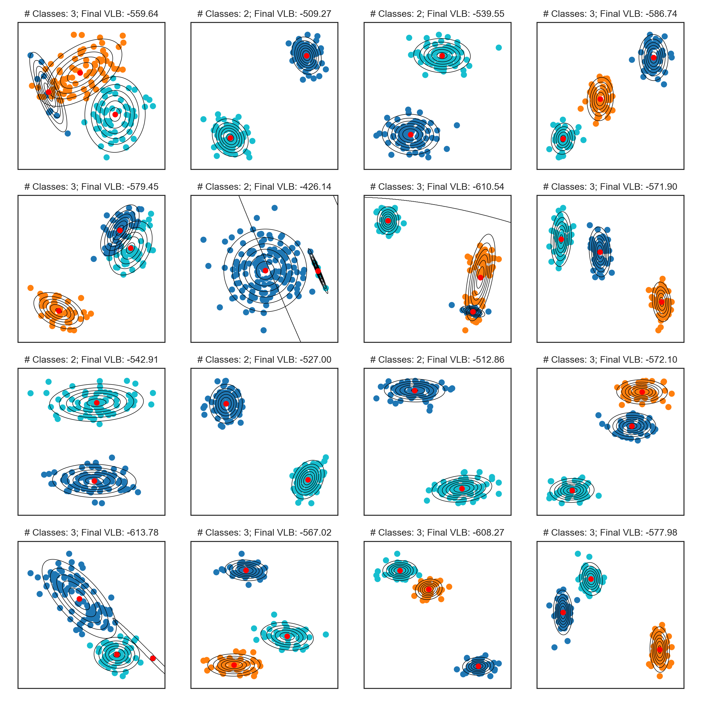

# Gaussian Mixture Models
The `gmm.py` module implements the standard (ie., non-Bayesian) [Gaussian mixture model](https://en.wikipedia.org/wiki/Mixture_model#Gaussian_mixture_model) with maximum-likelihood parameter estimates via the [EM algorithm](https://en.wikipedia.org/wiki/Expectation%E2%80%93maximization_algorithm).

## Plots

  

