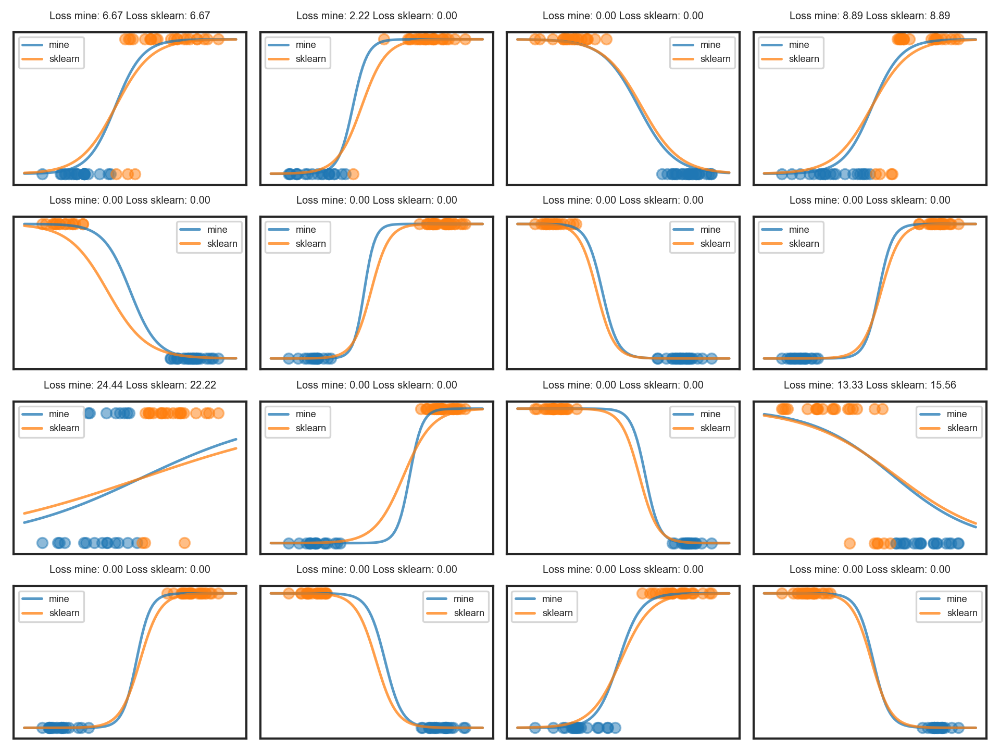
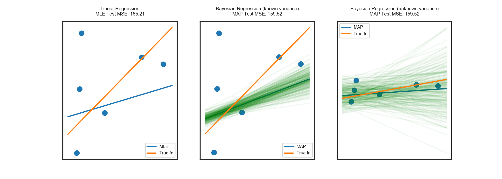

# Linear Models
The `lm.py` module implements:

1. [OLS linear regression](https://en.wikipedia.org/wiki/Ordinary_least_squares) with maximum likelihood parameter estimates via the normal equation.
2. [Ridge regression / Tikhonov regularization](https://en.wikipedia.org/wiki/Tikhonov_regularization)
   with maximum likelihood parameter estimates via the normal equation.
2. [Logistic regression](https://en.wikipedia.org/wiki/Logistic_regression) with maximum likelihood parameter estimates via gradient descent.
3. [Bayesian linear regression](https://en.wikipedia.org/wiki/Bayesian_linear_regression) with maximum a posteriori parameter estimates via [conjugacy](https://en.wikipedia.org/wiki/Conjugate_prior#Table_of_conjugate_distributions)
    - Known coefficient prior mean and known error variance
    - Known coefficient prior mean and unknown error variance

## Plots

