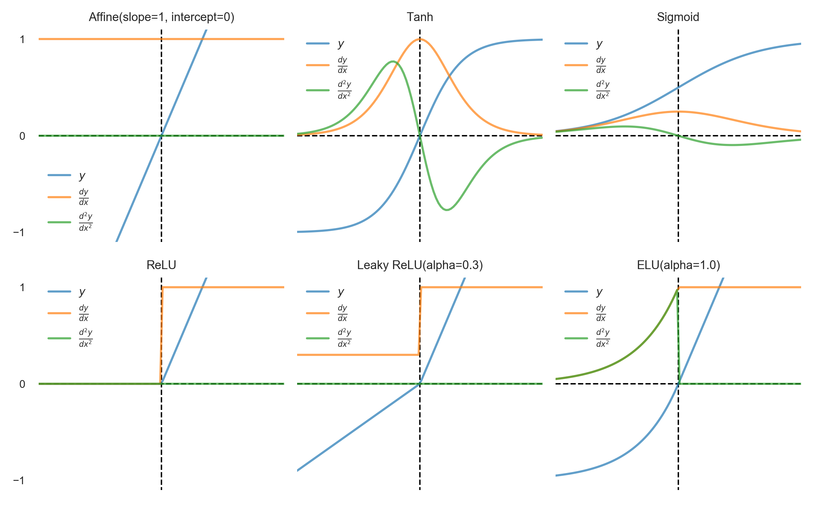

# Activation Functions
The `activations` module implements several common activation functions:

- Rectified linear units (ReLU) ([Hahnloser et al., 2000](http://invibe.net/biblio_database_dyva/woda/data/att/6525.file.pdf))
- Leaky rectified linear units
  ([Maas, Hannun, & Ng, 2013](https://ai.stanford.edu/~amaas/papers/relu_hybrid_icml2013_final.pdf))
- Hyperbolic tangent (tanh)
- Logistic sigmoid
- Affine

## Plots

