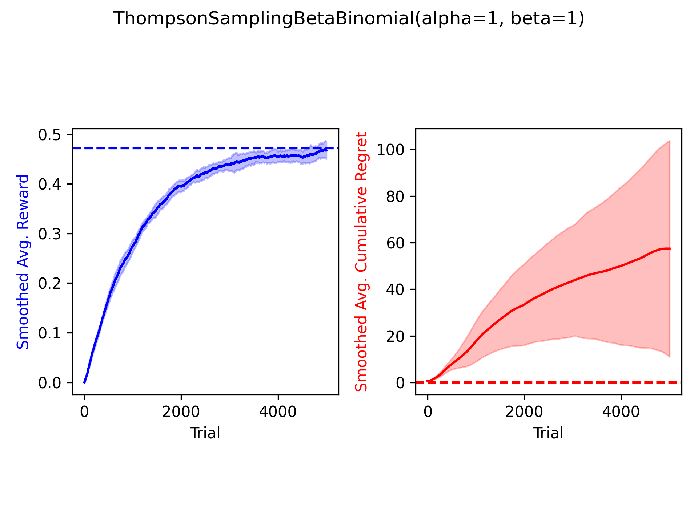
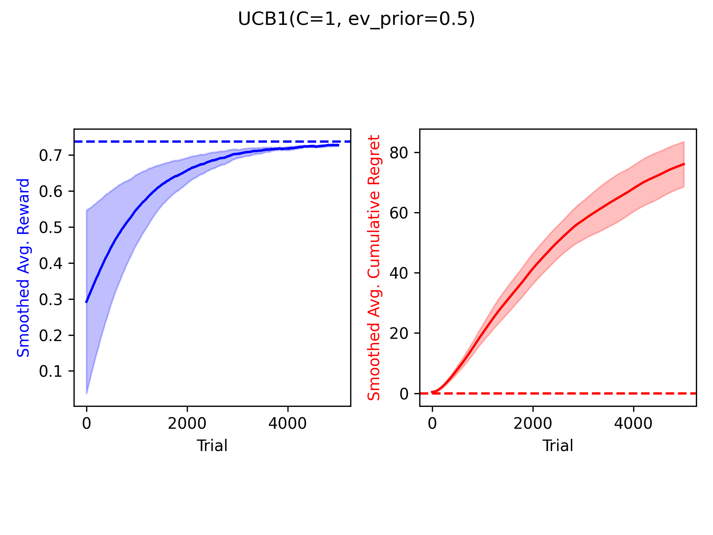
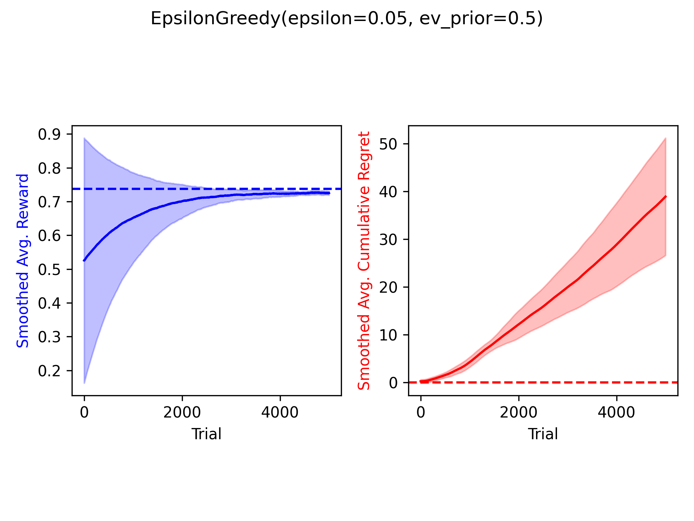

# Bandits
The `bandit.py` module includes several simple multi-arm bandit
environments.

The `policies.py` module implements a number of standard multi-arm bandit
policies.

1. **Bandits**
    - MAB: Bernoulli, Multinomial, and Gaussian payout distributions
    - Contextual MAB: Linear contextual bandits

2. **Policies**
    - Epsilon-greedy
    - UCB1 ([Auer, Cesa-Bianchi, & Fisher, 2002](https://link.springer.com/content/pdf/10.1023/A:1013689704352.pdf))
    - Conjugate Thompson sampler for Bernoulli bandits ([Thompson, 1933](https://www.gwern.net/docs/statistics/decision/1933-thompson.pdf); [Chapelle & Li, 2010](https://papers.nips.cc/paper/4321-an-empirical-evaluation-of-thompson-sampling.pdf))
    - LinUCB ([Li, Chu, Langford, & Schapire, 2010](http://rob.schapire.net/papers/www10.pdf))

## Plots

