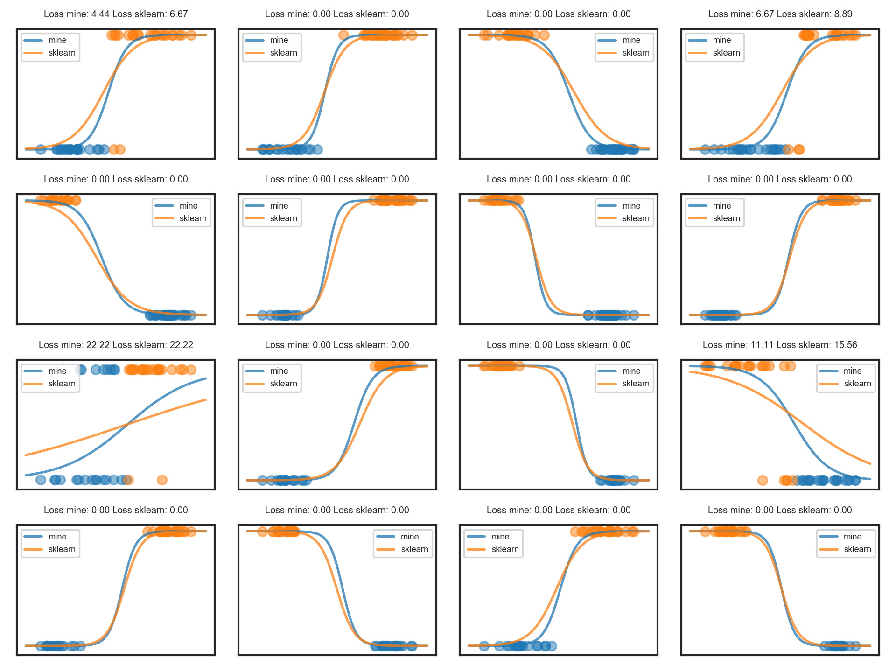
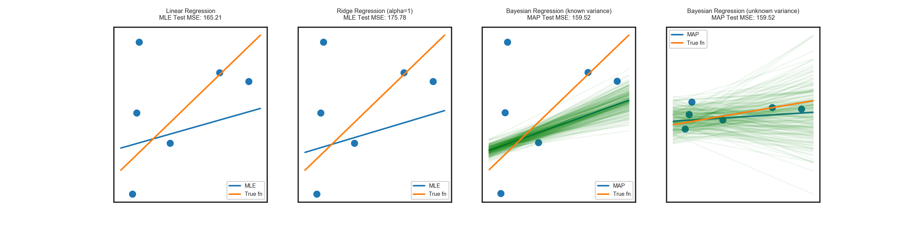
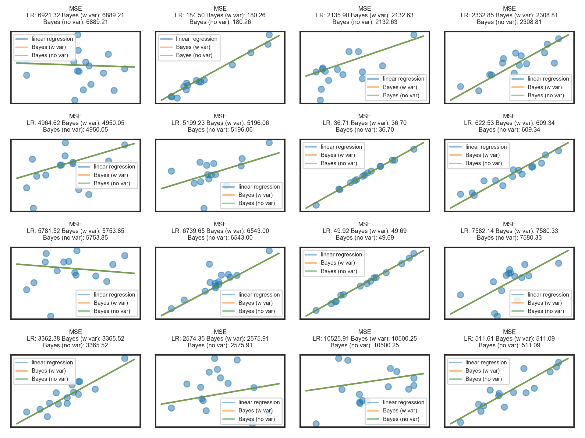

# Linear Models
The `linear_models` module includes:

1. [OLS linear regression](https://en.wikipedia.org/wiki/Ordinary_least_squares) with maximum likelihood parameter estimates via the normal equation. 
    - Includes optional weight arguments for [weighted least squares](https://en.wikipedia.org/wiki/Weighted_least_squares)
    - Supports batch and online coefficient updates.
3. [Ridge regression / Tikhonov regularization](https://en.wikipedia.org/wiki/Tikhonov_regularization)
   with maximum likelihood parameter estimates via the normal equation.
2. [Logistic regression](https://en.wikipedia.org/wiki/Logistic_regression) with maximum likelihood parameter estimates via gradient descent.
3. [Bayesian linear regression](https://en.wikipedia.org/wiki/Bayesian_linear_regression) with maximum a posteriori parameter estimates via [conjugacy](https://en.wikipedia.org/wiki/Conjugate_prior#Table_of_conjugate_distributions)
    - Known coefficient prior mean and known error variance
    - Known coefficient prior mean and unknown error variance
4. [Naive Bayes classifier](https://en.wikipedia.org/wiki/Naive_Bayes_classifier) with Gaussian feature likelihoods.
5. [Generalized linear model](https://en.wikipedia.org/wiki/Generalized_linear_model) with identity, log, and logit link functions.

## Plots

