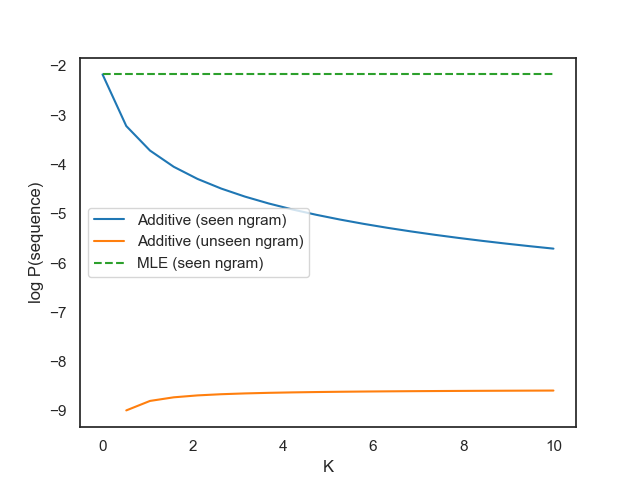

# N-Gram Sequence Models
The `ngram.py` module implements [n-gram models](https://en.wikipedia.org/wiki/N-gram) with different smoothing techniques:

- Maximum likelihood (no smoothing)
- [Additive smoothing](https://en.wikipedia.org/wiki/Additive_smoothing) (incl.
  Laplace smoothing, expected likelihood estimation, etc.)
- Simple [Good-Turing smoothing](https://en.wikipedia.org/wiki/Good%E2%80%93Turing_frequency_estimation) ([Gale, 1995](https://www.csie.ntu.edu.tw/~b92b02053/print/good-turing-smoothing-without.pdf))

## Plots

  

  

