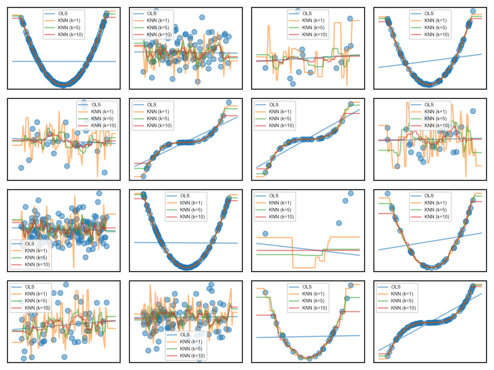
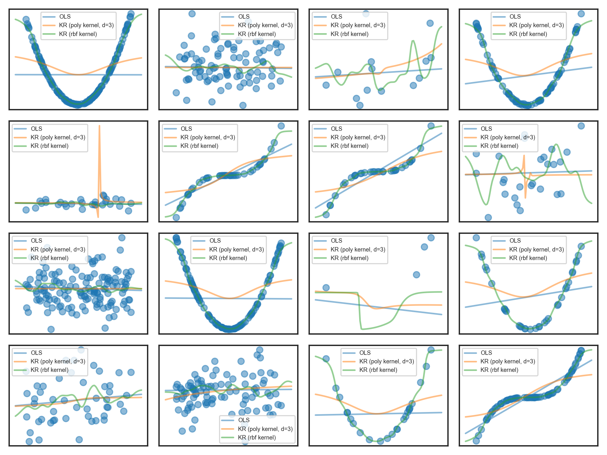
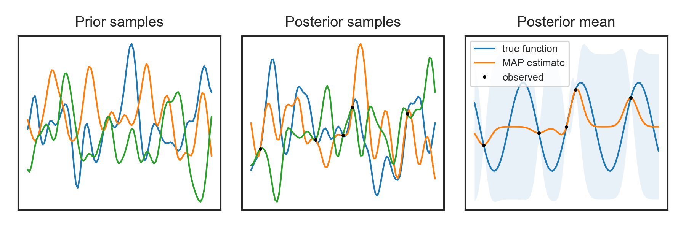

# Nonparametric Models
The nonparametric module implements several popular nonparameteric regression
and classification models.

- `kernel_regression.py` implements Nadaraya-Watson kernel regression
  ([Nadaraya, 1964](https://epubs.siam.org/doi/abs/10.1137/1109020); [Watson,
1964](https://www.jstor.org/stable/pdf/25049340.pdf))
- `knn.py` implements k-nearest neighbors regression and classification
  models using a ball-tree
- `gp.py` implements Gaussian process regression / simple kriging ([Krige, 1951](https://pdfs.semanticscholar.org/e497/8126fe00eca432b896ebcba978ba3f30a475.pdf); [Matheron, 1963](http://cg.ensmp.fr/bibliotheque/public/MATHERON_Publication_02396.pdf); [Williams & Rasmussen, 1996](http://mlg.eng.cam.ac.uk/pub/pdf/WilRas96.pdf))

## Plots

<strong>k-Nearest Neighbors</strong>

<strong>Nadaraya-Watson Kernel Regression</strong>

<strong>Gaussian Process Regression</strong>

