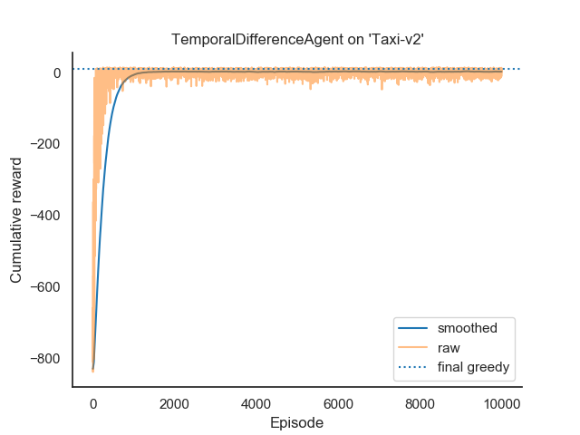
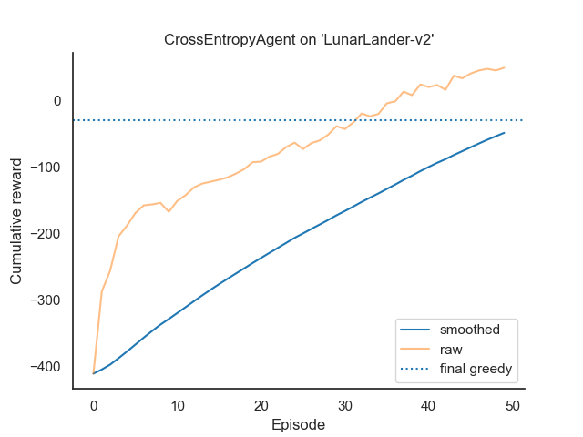
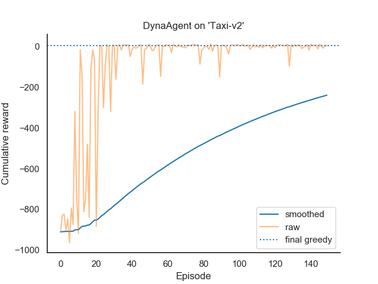

# RL Models
The `agents.py` module implements a number of standard reinforcement learning (RL) agents that
can be run on [OpenAI gym](https://gym.openai.com/) environments.

1. **Monte Carlo Methods**
    - First-visit Monte Carlo updates (on-policy)
    - Incremental weighted importance sampling (off-policy)
    - Cross-entropy method ([Mannor, Rubinstein, & Gat, 2003](https://www.aaai.org/Papers/ICML/2003/ICML03-068.pdf))

2. **Temporal-Difference Methods**
    - SARSA (on-policy) ([Rummery & Niranjan, 1994](http://mi.eng.cam.ac.uk/reports/svr-ftp/auto-pdf/rummery_tr166.pdf))
    - Q-learning (off-policy) ([Watkins, 1989](https://www.researchgate.net/profile/Christopher_Watkins2/publication/33784417_Learning_From_Delayed_Rewards/links/53fe12e10cf21edafd142e03.pdf))

3. **Model-Based Methods**
    - Dyna-Q/Dyna-Q+ with prioritized sweeping ([Sutton, 1990](http://papersdb.cs.ualberta.ca/~papersdb/uploaded_files/505/paper_sutton-90.pdf); [Moore & Atkeson, 1993](https://link.springer.com/content/pdf/10.1007/BF00993104.pdf))

## Plots

