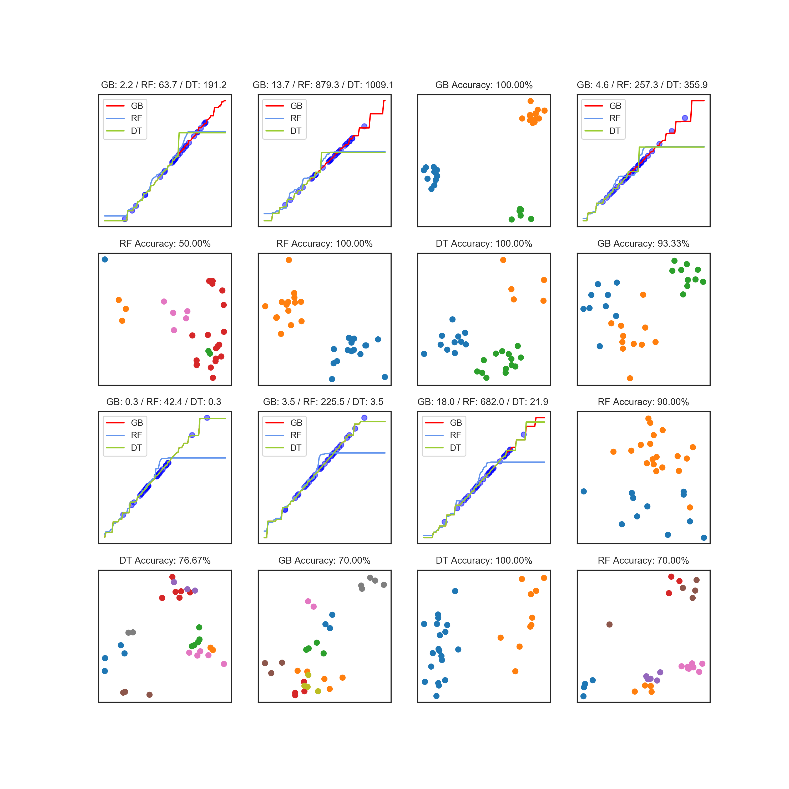

# Tree-Based Models
This module implements:

1. [Decision trees](https://en.wikipedia.org/wiki/Decision_tree_learning) for classification and regression via the CART algorithm
   (Breiman, Friedman, Olshen, & Stone, 1984).
2. [Random forests](https://en.wikipedia.org/wiki/Random_forest) for classification and regression (an example of bootstrap
   aggregating) (Breiman, 2001).
3. [Gradient-boosted decision
   trees](https://en.wikipedia.org/wiki/Gradient_boosting) for classification and regression (an
   example of gradient boosted machines) (Friedman, 1999).

## Plots

   

